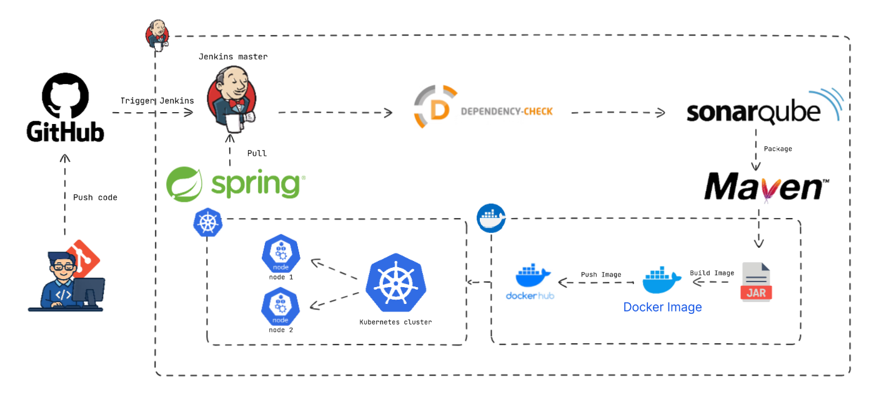

# E-shop

## Jenkins Pipeline

## *Pipeline Flow*
## 1. Code Development & Version Control

A developer pushes code to GitHub, which serves as the source code repository

This triggers the automated pipeline

## 2. Build & Integration (Jenkins)

Jenkins Master orchestrates the entire pipeline

Jenkins is triggered when code is pushed to GitHub

The Jenkins master coordinates with worker nodes to execute build tasks

## 3. Application Framework

The application is built using Spring Boot, a Java-based 
framework for creating microservices and web applications

## 4. Dependency Management & Security

Dependency-Check scans the project for known security vulnerabilities in third-party dependencies

This security scanning happens early in the pipeline to catch issues before deployment

## 5. Code Quality Analysis

SonarQube performs static code analysis to check for:

Code quality issues

Security vulnerabilities

Code coverage

Technical debt

Code smells and bugs

## 6. Package Management

Maven handles dependency management and creates the build artifacts (JAR files)

Maven compiles the code, runs tests, and packages the application

## 7. Containerization & Deployment

The application is containerized using Docker

Docker Hub stores the container images

The pipeline pushes the built Docker image to the registry

## 8. Orchestration

Kubernetes cluster (with 2 nodes shown) manages the deployment and scaling of containers

Kubernetes pulls the Docker image and deploys it across the cluster nodes
